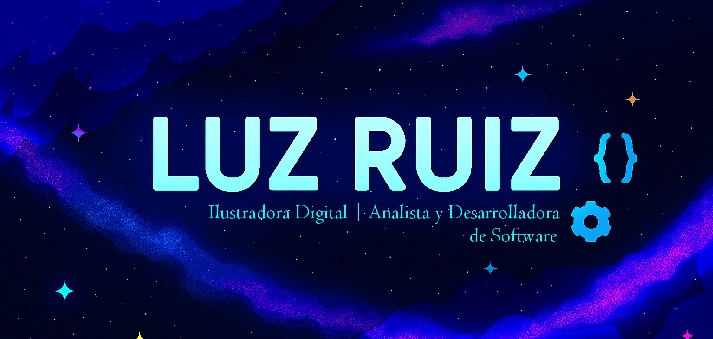

## Hi! Nice to meet you!👋

I'm Lucila Mercado Ruiz! i'm a Junior Fullstack Developer, Analyst, and Illustrator. I enjoy building creative solutions, analyzing data, and bringing ideas to life through code and art.

<table style="border:none;">
  <tr>
    <td style:"border:none;">
    <h3>About Me</h3>
    <ul> 🔭 I’m currently working as an instructor: teaching programming, databases, and digital illustration.</ul>
    <ul>🌱 I’m currently learning React, PowerBI</ul>
    <ul>👯 I’m looking to collaborate on creative web development projects, data analysis, and digital art initiatives.</ul>
    <ul>🤔 I’m looking for help with improving my skills in advanced backend frameworks and cloud technologies.</ul>
    <ul>💬 Ask me about programming fundamentals, database design, or digital illustration techniques.</ul>
    <ul>📫 How to reach me: [LinkedIn](https://www.linkedin.com/in/lucila-mercado-ruiz-98729a276/) | [Email](mailto:mercadoruizlucila@gmail.com) </ul>
  </td>
    <td style="border:none;">
      
    </td>
  </tr>
 
</table>

